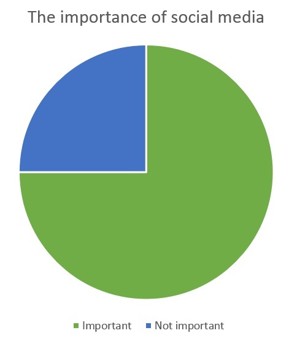
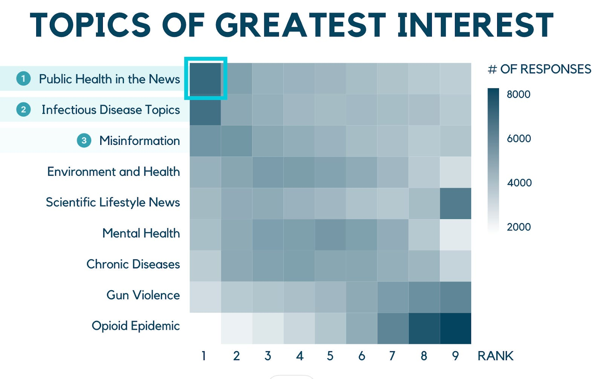

```{r setup, include=FALSE}
usethis::use_git_ignore(c("*.csv", "*.rds"))
options(htmltools.dir.version = FALSE)

library(knitr)
library(tidyverse)
library(xaringan)
library(fontawesome)
```

class: inverse, center, middle

# `r fa("fas fa-images", fill = "#fff")`

**View the slides:** 

[bretsw.com/edf5442-ss24-module4](https://bretsw.com/edf5442-ss24-module4)

---

class: inverse, center, middle

# Standup

```{r, out.width = "100%", echo = FALSE, fig.align = "center"}
include_graphics("img/standup.png")
```

---

class: inverse, center, middle

# `r fa("fas fa-list-check", fill = "#fff")` <br><br> Check Your Email: <br> Most Recent Survey Request

---

class: inverse, center, middle

# `r fa("fas fa-list-check", fill = "#fff")` <br><br> Survey Examples

---

# `r fa("fas fa-list-check", fill = "#fff")` Survey Example 1

### [Pop Culture Survey](https://bridgingthegenerationgap.wordpress.com/2013/09/27/pop-culture-survey/)

```{r, out.width = "400px", echo = FALSE, fig.align = "center"}

```

---

# `r fa("fas fa-list-check", fill = "#fff")` Survey Example 2

### [Your Local Epidemiologist Survey](https://yourlocalepidemiologist.substack.com/p/were-still-here)

```{r, out.width = "600px", echo = FALSE, fig.align = "center"}

```

---

# `r fa("fas fa-list-check", fill = "#fff")` Survey Example 3

### [r/SampleSize](https://www.reddit.com/r/SampleSize/): Subreddit of Surveys

```{r, out.width = "256px", echo = FALSE, fig.align = "center"}

```

**Choose-your-own survey...**


---

class: inverse, center, middle

# Sorting

```{r, out.width = "100%", echo = FALSE, fig.align = "center"}
include_graphics("img/plinko.png")
```


---

class: inverse, center, middle

# Scrum Teams

```{r, out.width = "100%", echo = FALSE, fig.align = "center"}
include_graphics("img/scrum.png")
```

---

# `r fa("fas fa-list-check", fill = "#fff")` Team Assignments

--

### Team Astronaut

Chen, I. J., Yang, K. F., Tang, F. I., Huang, C. H., & Yu, S. (2008). Applying the technology acceptance model to explore public health nurses’ intentions towards web-based learning: A cross-sectional questionnaire survey. *International Journal of Nursing Studies, 45*(6), 869-878. https://doi.org/10.1016/j.ijnurstu.2006.11.011

--

<hr>

### Team Heron

Gosling, S. D., Rentfrow, P. J., & Swann Jr, W. B. (2003). A very brief measure of the Big-Five personality domains. *Journal of Research in Personality, 37*(6), 504-528. https://doi.org/10.1016/S0092-6566(03)00046-1

--

<hr>

### Team Otter

Paiva, P. C. P., Paiva, H. N. D., Oliveira Filho, P. M. D., Lamounier, J. A., Ferreira, E. F. E., Ferreira, R. C., ... & Zarzar, P. M. (2014). Development and validation of a social capital questionnaire for adolescent students (SCQ-AS). *PLOS ONE, 9*(8), e103785. https://doi.org/10.1371/journal.pone.0103785

---

# `r fa("fas fa-list-check", fill = "#fff")` Evaluating Surveys: Step 1

```{r, out.width = "560px", echo = FALSE, fig.align = "center"}
include_graphics("img/survey.png")
```

--

Skim the articles and answer the following:

--

1. What was the purpose of the study?

--

2. Who were the participants in the study (population and sample)?

--

3. How was the survey developed?

--

4. How was the survey administered?

---

# `r fa("fas fa-list-check", fill = "#fff")` Evaluating Surveys: Step 2

```{r, out.width = "560px", echo = FALSE, fig.align = "center"}
include_graphics("img/survey.png")
```

Pass your notes to the right, skim the other team's work, and answer the following:

--

1. How well did the survey contribute to the purpose of the study?

--

2. How well did the survey sample represent the population?

--

3. How well did the survey development and administration contribute to validity and reliability?

---

# `r fa("fas fa-list-check", fill = "#fff")` Evaluating Surveys: Step 3

```{r, out.width = "560px", echo = FALSE, fig.align = "center"}
include_graphics("img/survey.png")
```

Pass your notes to the right again, skim the previous two teams' work, and answer the following:

--

1. What are the key lessons about surveys we can learn from this example?


---

class: inverse, center, middle

# Standup

```{r, out.width = "100%", echo = FALSE, fig.align = "center"}
include_graphics("img/standup.png")
```


---

class: inverse, center, middle

# Project Teams

```{r, out.width = "100%", echo = FALSE, fig.align = "center"}
include_graphics("img/scrum.png")
```

**Start to talk through developing your survey instrument...**


---

class: inverse, center, middle

# `r fa("fas fa-binoculars", fill = "#fff")` <br><br> Looking ahead

---

# `r fa("fas fa-calendar-day", fill = "#fff")` Semester Schedule

```{r, out.width = "360px", echo = FALSE, fig.align = "center"}
include_graphics("img/across-time.jpg")
```

- ~~Module 1: Introduction to Inquiry~~

- ~~Module 2: Reviewing the Literature~~

- ~~Module 3: Planning for Inquiry~~

- **Module 4: Measurement: Surveys & Tests**

- **Module 5:** Measurement: Interviews

- **Module 6:** Analysis: Quantitative

- **Module 7:** Analysis: Qualitative

- **Module 8:** Ethics & Reporting

---

# `r fa("far fa-keyboard", fill = "#fff")` Major Assignments

```{r, out.width = "240px", echo = FALSE, fig.align = "center"}
include_graphics("img/build.jpg")
```

### Individual Assignments (20%)

- ~~Problem Statement and Annotated Bibliography (10%)~~
- **Test Items** (10%) - due in Module 7

### Group Assignments (50%)

- ~~Inquiry Plan** (5%)~~
- **Survey Instrument (10%) - due in Module 5**
- **Interview Protocol** (10%) - due in Module 6
- **Survey Reflection & Write-up** (10%) - due in Module 8
- **Final Report** (15%) - due at end of semester

### Participation (30%)

- **Weekly Class Activities** (2% each week)

---

class: inverse, center, middle

# `r fa("fas fa-question", fill = "#fff")` <br><br> Questions

<hr>

**What questions can I answer for you now?**

**How can I support you this week?**

<hr>

`r fa("fas fa-envelope", fill = "#fff")` [bret.staudtwillet@fsu.edu](mailto:bret.staudtwillet@fsu.edu) | `r fa("fas fa-globe", fill = "#fff")` [bretsw.com](https://bretsw.com) | `r fa("fab fa-github", fill = "#fff")` [GitHub](https://github.com/bretsw/)